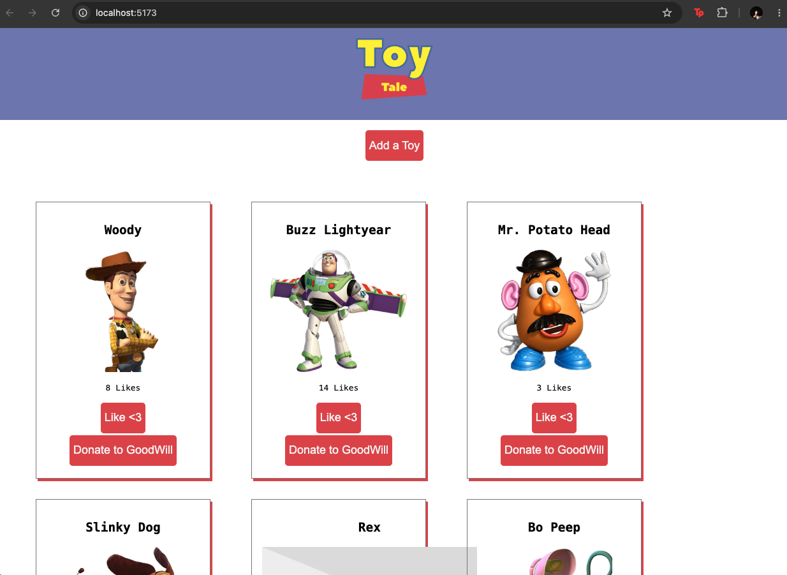

# Toy Tales

A React CRUD application for managing Andy's collection of toys.

Users can view all toys, add new toys, like toys, and donate toys. The React
frontend communicates with a JSON Server backend using RESTful API requests.

## Features

- Display all toys when the application loads
- Add a new toy to the collection
- Like a toy to increase its like count
- Donate a toy to remove it from the collection
- Dynamically update the page after each CRUD operation

## CRUD Operations

### GET - Display Toys

When the application loads, it makes a GET request to `/toys` and displays
each toy using the `ToyCard` component.

### POST - Add a Toy

When the add-toy form is submitted, the application makes a POST request to
`/toys` to create a new toy. New toys start with 0 likes.

### DELETE - Donate a Toy

When the "Donate to GoodWill" button is clicked, the application makes a
DELETE request to `/toys/:id` and removes the toy from the page.

### PATCH - Like a Toy

When the "Like <3" button is clicked, the application makes a PATCH request
to `/toys/:id` to increase the toy's like count. The updated likes are also
reflected on the page.

## Technologies

- React
- JavaScript
- Vite
- JSON Server
- Vitest
- React Testing Library

## Setup

All toy data is stored in `db.json`. JSON Server provides the RESTful API
used by the React application.

### Install dependencies

```bash
npm install
```

## Testing

The application includes tests for:
- Displaying all toys
- Adding a toy
- Donating a toy
- Liking a toy

The completed test suite contains 5 tests across 4 test files.

## Screenshots



## Project Structure
src/
├── components/
│   ├── App.jsx
│   ├── Header.jsx
│   ├── ToyCard.jsx
│   ├── ToyContainer.jsx
│   └── ToyForm.jsx
└── __tests__/
    ├── AllToys.test.jsx
    ├── Donate.test.jsx
    ├── Like.test.jsx
    └── ToyForm.test.jsx

db.json
README.md
package.json

